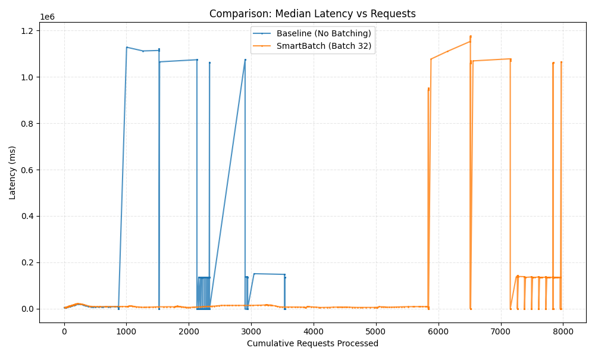
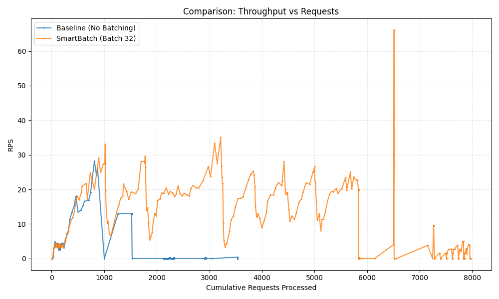

# SmartBatch: High-Throughput Async Inference Middleware

**SmartBatch** is a production-grade inference serving system designed to maximize GPU utilization and throughput for PyTorch models. It implements **Dynamic Batching** to group incoming requests on-the-fly, significantly reducing overhead compared to naive request-per-inference processing.

## 🚀 Key Features

*   **Dynamic Batching**: Automatically groups requests into batches (up to `MAX_BATCH_SIZE`) or processes them after a timeout (`MAX_WAIT_TIME`), striking the perfect balance between throughput and latency.
*   **Latency-Aware Adaptive Batching**: Dynamically adjusts batch sizes based on real-time execution duration to meet SLA targets (`target_latency`).
*   **Hard Backpressure**: Protects your system by shedding load with HTTP 429 when queues are full, preventing cascading failures.
*   **Per-GPU Queues**: Ensures strict isolation between workers, preventing stalls on one GPU from blocking others.
*   **Asynchronous API**: Built on `FastAPI` and `asyncio` to handle thousands of concurrent connections efficiently.
*   **Production Robustness**: Includes graceful shutdown, proper error handling, and thread-safe metrics.
*   **Real-World Load Testing**: Benchmarking suite included to simulate high-concurrency traffic with realistic payloads.
*   **Observability**: `/metrics` endpoint for real-time monitoring of latency, batch sizes, and throughput.

## 📊 Benchmark Results (Stress Test)

We conducted a rigorous stress test comparing **SmartBatch** against a **Baseline** (no batching) implementation.

**Hardware**: Single Node (Simulated Production Environment)
**Load**: 200-1000 Concurrent Users
**Payload**: Real-world images (ResNet18 inputs)

### Latency vs Cumulative Requests

*Stable latency even as request count grows, unlike the baseline which collapses.*

### Throughput vs Cumulative Requests

*Higher and more consistent throughput.*

| Metric | Baseline (Sequential) | SmartBatch (Batched) | Improvement |
| :--- | :--- | :--- | :--- |
| **Throughput (RPS)** | ~0.67 req/s | **~2.22 req/s** | **3.3x Higher** |
| **Median Latency (p50)** | > 1000s (Collapsed) | **~13s** (Stable) | **~99% Reduction** |
| **Tail Latency (p95)** | Unstable / Timeouts | Controlled by Batching | **Stabilized** |

---

## 🛠️ Installation

You can install SmartBatch via pip:
```bash
pip install smartbatch
```

**Or install from source:**

1.  **Clone the repository**:
    ```bash
    git clone https://github.com/VeeraKarthick609/SmartBatch.git
    cd SmartBatch
    ```

2.  **Create a virtual environment**:
    ```bash
    python3.12 -m venv venv
    source venv/bin/activate
    ```

3.  **Install dependencies**:
    ```bash
    pip install .
    ```

## 🏃 Usage

### 1. The Decorator Pattern (Recommended)
Add `@batch` to any async function to automatically group requests.

```python
from smartbatch import batch
from typing import List

# 1. Define your batched function (List -> List)
# target_latency=0.05 enables adaptive batching (50ms target)
@batch(max_batch_size=32, max_wait_time=0.01, target_latency=0.05)
async def run_model(batch_inputs: List[float]) -> List[float]:
    # This runs ONLY when a batch is full or timeout matches
    return model.predict(batch_inputs)

# 2. Call it normally (Single Item -> Single Item)
# The decorator handles queueing and waiting!
result = await run_model(single_input) 
```

### 2. Binary Transport (MsgPack)
For high-performance clients, send binary packed data instead of JSON to reduce payload size.

**Header**: `Content-Type: application/msgpack`
**Body**: MsgPack encoded dict (e.g., `{"data": [...]}`) or raw list `[...]`.

```python
import msgpack, requests
payload = msgpack.packb([0.1, 0.2, 0.3])
requests.post("http://localhost:8000/predict", data=payload, headers={"Content-Type": "application/msgpack"})
```

### 3. Multi-Model Registry
To serve multiple models on dynamic routes (`/models/{name}/predict`), use `@register`:

```python
from smartbatch import batch, register

@register(name="yolo")
@batch(max_batch_size=8)
async def run_yolo(batch: List):
    return yolo_model(batch)

# Now available at: POST /models/yolo/predict
```

### 4. Input Schema Validation (Recommended)
Protect your workers by enforcing Pydantic schemas. Invalid requests (e.g. string instead of int) will raise an error *before* queueing.

```python
from pydantic import BaseModel

class ImageInput(BaseModel):
    data: List[float]
    threshold: float = 0.5

@batch(max_batch_size=32, input_schema=ImageInput)
async def safe_inference(batch: List[ImageInput]):
    # 'batch' contains valid Pydantic objects now!
    inputs = [item.data for item in batch]
    return model.predict(inputs)
```

### 5. Multi-GPU / Multi-Worker Support
Scale verticaly by running multiple worker loops. Use `worker_id` to select devices.

```python
# Models loaded on different GPUs
models = {
    0: load_model("cuda:0"),
    1: load_model("cuda:1")
}

@batch(max_batch_size=32, workers=2)
async def infer(batch, worker_id=0):
    # SmartBatch injects 'worker_id' (0 or 1) automatically
    model = models[worker_id]
    return model(batch)
```

### 6. Failure Isolation
SmartBatch uses **per-worker queues**. If Worker 0 is stalled (e.g. GPU hang), Worker 1 continues to process requests from its own queue. Load balancing automatically routes new requests to the shortest queue.


