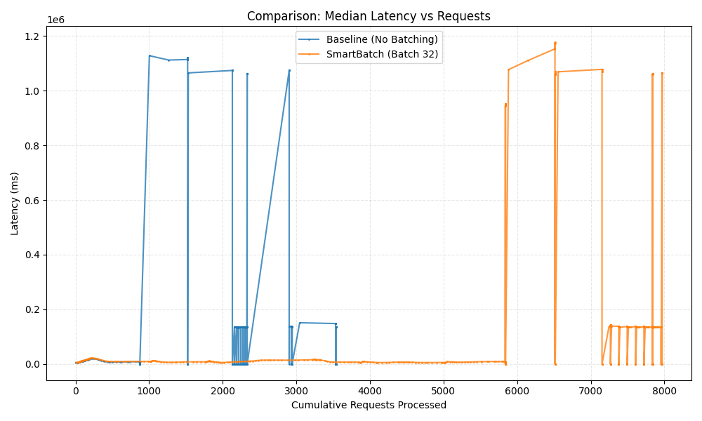
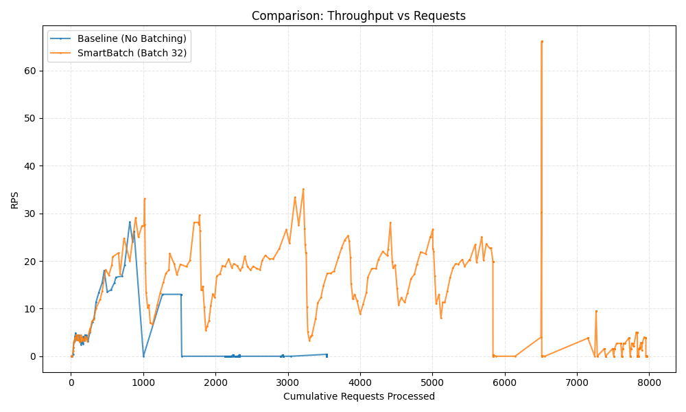

# SmartBatch: High-Throughput Async Inference Middleware

**SmartBatch** is a production-grade inference serving system designed to maximize GPU utilization and throughput for PyTorch models. It implements **Dynamic Batching** to group incoming requests on-the-fly, significantly reducing overhead compared to naive request-per-inference processing.

## Key Features

- **Dynamic Batching**: Automatically groups requests into batches (up to `max_batch_size`) or flushes them after a timeout (`max_wait_time`).
- **Latency-Aware Adaptive Batching**: Adjusts batch sizes at runtime using P95 latency to meet SLA targets (`target_latency`).
- **Hard Backpressure**: Sheds load with HTTP 429 when queues are full, preventing cascading failures.
- **Per-GPU Queues**: Strict worker isolation — a stall on one GPU does not block others.
- **Dynamic Model Registration**: Register or deregister models at runtime via the admin API without restarting the server.
- **Fault Isolation**: Circuit breaker + per-item fallback retries isolate bad inputs without failing the entire batch.
- **MsgPack Transport**: Binary payload support for high-throughput clients.
- **Observability**: `/metrics` endpoint with request counts, error rates, and latency/batch percentiles.

## Advanced Features

### SLA-Aware Admission Control
SmartBatch uses **Little's Law** to estimate wait time from current queue depth and throughput. Requests exceeding the SLA budget are rejected immediately with `429 Too Many Requests`, preventing queue-buildup spirals.

### P95-Based Adaptive Batching
SmartBatch tracks **P95 latency** of each batch and applies multiplicative decrease when the tail exceeds `target_latency`, and additive increase when well within budget. This prevents a few slow requests from hiding a latency problem.

### Fault Isolation & Partial Recovery
If a batch fails, SmartBatch retries each item **individually** to isolate the bad input. The **Circuit Breaker** opens after repeated failures and probes recovery via half-open state before resuming normal traffic.

---

## Benchmark Results

Stress test comparing SmartBatch against a baseline (no batching).

**Hardware**: Single node (simulated production environment)  
**Load**: 200–1000 concurrent users  
**Payload**: ResNet18 image inputs




| Metric | Baseline | SmartBatch | Improvement |
| :--- | :--- | :--- | :--- |
| **Throughput (RPS)** | ~0.67 req/s | ~2.22 req/s | 3.3x |
| **Median Latency (p50)** | >1000s (collapsed) | ~13s (stable) | ~99% reduction |
| **Tail Latency (p95)** | Unstable / timeouts | Controlled by batching | Stabilized |

---

## Installation

```bash
pip install smartbatch
```

Or from source:

```bash
git clone https://github.com/VeeraKarthick609/SmartBatch.git
cd SmartBatch
python3.12 -m venv venv
source venv/bin/activate
pip install .
```

---

## Usage

### 1. Basic decorator

```python
from smartbatch import batch
from typing import List

@batch(max_batch_size=32, max_wait_time=0.01, target_latency=0.05)
async def run_model(batch_inputs: List[float]) -> List[float]:
    return model.predict(batch_inputs)

# Call with a single item — batching happens automatically
result = await run_model(single_input)
```

### 2. Multi-model registry

Register multiple models (and versions) on dynamic routes:

```python
from smartbatch import batch, register

@register(name="yolo", version="v1")
@batch(max_batch_size=8)
async def run_yolo_v1(batch: List):
    return yolo_v1(batch)

@register(name="yolo", version="v2")
@batch(max_batch_size=8)
async def run_yolo_v2(batch: List):
    return yolo_v2(batch)

# POST /models/yolo/predict        -> latest version (v2)
# POST /models/yolo/predict?version=v1 -> v1
```

### 3. Dynamic registration via API

Register or remove models at runtime without restarting the server.

**Register**
```bash
POST /admin/models/{name}
Content-Type: application/json

{
  "module": "myapp.models",
  "function": "infer",
  "version": "v2",
  "max_batch_size": 16,
  "max_wait_time": 0.01,
  "workers": 1,
  "target_latency": 0.05
}
```

The `module` must be importable in the server's Python environment. The function must accept `List[Any]` and return `List[Any]` of the same length.

**Deregister**
```bash
DELETE /admin/models/{name}/{version}
```

### 4. Input schema validation

Validate inputs with Pydantic before they enter the queue:

```python
from pydantic import BaseModel

class ImageInput(BaseModel):
    data: List[float]
    threshold: float = 0.5

@batch(max_batch_size=32, input_schema=ImageInput)
async def safe_inference(batch: List[ImageInput]):
    inputs = [item.data for item in batch]
    return model.predict(inputs)
```

### 5. Multi-GPU / multi-worker

```python
models = {0: load_model("cuda:0"), 1: load_model("cuda:1")}

@batch(max_batch_size=32, workers=2)
async def infer(batch, worker_id=0):
    return models[worker_id](batch)
```

### 6. MsgPack transport

```python
import msgpack, requests

payload = msgpack.packb({"data": [0.1, 0.2, 0.3]})
requests.post(
    "http://localhost:8000/models/yolo/predict",
    data=payload,
    headers={"Content-Type": "application/msgpack"},
)
```

---

## API Reference

| Method | Path | Description |
| :--- | :--- | :--- |
| `POST` | `/models/{name}/predict` | Run inference. Optional `?version=` query param. |
| `GET` | `/admin/models` | List all registered models and versions. |
| `POST` | `/admin/models/{name}` | Dynamically register a model from an importable module. |
| `DELETE` | `/admin/models/{name}/{version}` | Deregister a specific model version. |
| `GET` | `/metrics` | JSON metrics: request counts, error rate, latency p50/p95/p99, batch stats. |
| `GET` | `/health` | Health check. |

---

## Examples

A full ResNet example is in `.examples/`:

- `.examples/resnet_server.py` — versioned SmartBatch model service
- `.examples/resnet_client.py` — concurrent JSON/MsgPack load client
- `.examples/README.md` — run instructions
